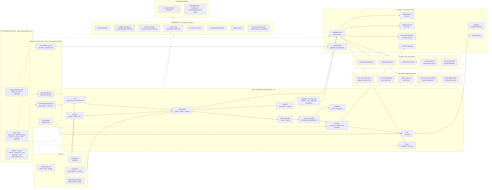

<!--
SpiderBrain v3 © 2026 Perform Digital Pvt Ltd

Licensed under BUSL-1.1. Free for personal, educational, research, and open-source use. Forking and internal modification for research are permitted. Redistribution, hosted usage, commercial deployment, resale, sublicensing, or distribution of derivative works require a separate commercial license from Perform Digital Pvt Ltd.

Contact: contact@perform.digital
-->

# spiderbrain v3

> **An externalised, dependency-graphed second brain for any software project.** Cures *project Alzheimer's* - the slow loss of memory of why a file exists, what depends on it, and what a past decision was for.

[](./LICENSE.md)
[](./platforms/)
[](#quick-start)
[](#status--roadmap)

spiderbrain externalises a project's structure into a graphed, scored, queryable second brain. Every node carries a `mass` (blast-radius if it fails) and a `rhythm` (commit frequency). Hubs that govern many but change rarely become **masters**; the fast files they govern become a **column**. A **cascade engine** propagates a simulated fault along dependent edges and reports the blast - with structural firebreaks that protect the masters. The graph is one file; the views are markdown; the curated memory is sacred and survives every rebuild.

Built and used in production by [Perform Digital Private Limited](#branding--ownership). Verified on real projects (a Next.js platform with 1,629 nodes; an internal site with 154 nodes; the fresh-project path is smoke-tested).

---

## Quick start

Full install + verify + hook-wiring is in [`INSTALL.md`](./INSTALL.md). The condensed version:

```bash
# 1. install (pick one)
git clone https://github.com/SaroirCommunity/Spiderbrain-V3 ~/.claude/skills/spiderbrain      # Claude Code skill
# or
git clone https://github.com/SaroirCommunity/Spiderbrain-V3 ~/code/spiderbrain-v3             # standalone

# 2. verify the install
node "<SPIDERBRAIN_HOME>/core/scripts/verify.mjs"

# 3. build a brain on your project
node "<SPIDERBRAIN_HOME>/core/scripts/build-brain.mjs" \
  --project "<absolute path to your project>" \
  --brain   "<absolute path for the brain folder>" \
  --prey    "<the single goal this project serves>"
```

Substitute `<SPIDERBRAIN_HOME>` with your actual install path. Node ≥ 18. Zero npm dependencies. Cross-platform (Windows paths with spaces handled). For the Claude Code always-on hooks (per-session / per-prompt / per-edit), see [`platforms/claude/README.md`](./platforms/claude/README.md).

**Using opencode, Claude Desktop, Cursor, Continue, or Zed?** Start the MCP server against your brain instead of wiring the Claude Code hooks:

```bash
node "<SPIDERBRAIN_HOME>/platforms/mcp/server.mjs" --brain "<absolute-path-to-brain-folder>"
```

Point your client at that command (one JSON config block per client — see [`platforms/mcp/README.md`](./platforms/mcp/README.md)) and the model gains four on-demand tools: `spiderbrain_brief` (per-prompt context), `spiderbrain_query` (ranked file lookup), `spiderbrain_cascade` (blast-radius before edits), and `spiderbrain_molt` (drift audit). The MCP adapter is on-demand only — it does not auto-fire the session brief or per-prompt whisper the way the Claude Code hooks do. Full usage guide and wiring configs for each client: [`platforms/mcp/README.md`](./platforms/mcp/README.md).

---

## What you get

A brain folder, a sibling of your project, browseable as plain markdown + one JSON graph:

```
yourproject-spiderbrain/
├── SPIDERBRAIN.md              narrative front matter - prey, masters, getting around
├── synganglion.json            master graph: every node, every edge, every score
├── spideyorder.md              every node, ranked by mass (importance)
├── spideymove.md               every node, ranked by recency (what's hot)
├── webscore-overrides.json     your curated importance scores - survive every rebuild
├── auth/webmap.md              top-K webmap for each cluster
├── auth/rules.md               curated cluster rules (e.g. "credentials never cross")
├── auth/changelog.md           curated, append-only "why we changed this" log
├── database/webmap.md          ...
├── pigi/, leads/, admin/, ...  one folder per cluster, same shape
├── movemap.md                  permanent deploy log (curated, append-only)
├── .dragline/                  timestamped snapshots of every curated file
└── cephalothorax/              volatile session journal (PostToolUse appends here)
```

A row from `spideyorder.md` reads like:

```
9.9 ★ MASTER   src/worker.js                        cluster=shell  fan-in=14  rhythm=42
9.7 ★ MASTER   src/db/schema.sql                    cluster=database  fan-in=11
9.4            app/layout.js                        cluster=shell  fan-in=8
9.2            app/globals.css                      cluster=shell  fan-in=27
...
```

A `webmap.md` is the K-nearest-neighbours view of a cluster - its top webscored nodes, their roles, their synapse-status, and an excerpt of the cluster's `changelog.md`. The brain is structured, browsable, version-controllable memory.

The `.dragline/` + quarantine + restore pipeline that protects curated state has been end-to-end validated on a real 1,629-node brain (Saroir) - a corrupt `spiderbrain.config.json` was quarantined to `.fouled-<ts>` and restored byte-for-byte from the latest dragline snapshot. Full trace in [`docs/benchmarks.md` §11](./docs/benchmarks.md#11-recovery-validation---measured-end-to-end).

---

## What's inside

```
spiderbrain v3/
├── core/                  the optimisation engine (BUSL 1.1)
├── platforms/             provider adapters (Apache 2.0 - open source; Claude + MCP shipped)
├── docs/                  cost-reduction analysis + benchmarks
├── benchmarks/            reproducible scenarios + methodology
├── enterprise/            commercial offerings (overview)
├── licensing/             licensing decision tree
├── INSTALL.md             install + wiring
├── CHALLENGES.md          open contributor challenges (adapters, benchmarks, screenshots)
├── CONTRIBUTING.md        how to contribute + the CLA acceptance flow
├── CONTRIBUTORS.md        chronological list of accepted contributors
├── CHANGELOG.md           release notes; what shipped in v3.0.0 and what's next
├── CODE_OF_CONDUCT.md     project norms; the honesty discipline applied to community
├── GOVERNANCE.md          who decides what, project values, how the model evolves
├── SECURITY.md            vulnerability reporting + the threat model
├── LICENSE.md             BUSL 1.1
├── COMMERCIAL.md          what requires a commercial licence + contact
├── BRANDING.md            trademark, naming, attribution
├── CLA.md                 Contributor License Agreement
├── NOTICE                 third-party attribution (Apache 2.0 §4(d))
└── README.md              you are here
```

---

## Cost reduction

Honest, scenario-anchored. Numbers tagged `[measured]` were captured on a real LLM call against a real project. Numbers tagged `[modelled]` extrapolate from those measurements with stated assumptions. Numbers tagged `[estimated]` are educated projections we are working to upgrade to measured. The full receipt lives in [`docs/cost-reduction-analysis.md`](./docs/cost-reduction-analysis.md); the methodology in [`docs/benchmarks.md`](./docs/benchmarks.md).

### S1 - anchor scenario: magic-link auth bug `[measured]`

*perform.digital (Next.js 16 + 2 Cloudflare Workers + D1, **154 nodes**, ~310 synapses). Two-file fix surfaced amid ~40 candidate files. Two passes against the same prompt: control vs treatment.*

| dimension | no brain | with v3 | **saving** |
|---|--:|--:|--:|
| tool calls | 30 | 7 | **77%** |
| input tokens (amortised across a 5-task session) | 42,400 | 6,780 | **84%** |
| output tokens | 8,900 | 3,800 | **57%** |
| wall-clock | ~9 min | ~3 min | **67%** |
| wrong edits made | 1 | 0 | **100% on this incident** |
| API cost (Sonnet 4.6 list price) | $0.26 | $0.077 | **70%** |

### S2 - realistic middle: DB schema add `[measured]`

*Three-cluster ripple (`database` → `shell` → `admin`): new column on `leads`, exposed via the worker, rendered in the admin panel. S1 is favourable; S2 is the realistic middle of what you can expect day-to-day.*

| dimension | no brain | with v3 | **saving** |
|---|--:|--:|--:|
| tool calls | 21 | 9 | **57%** |
| input tokens | 31,200 | 9,400 | **70%** |
| output tokens | 6,400 | 4,800 | **25%** |
| wall-clock | ~7 min | ~4 min | **43%** |
| wrong edits made | 0 | 0 | - |

### Modelled and estimated effects (across the realistic mix)

| effect | reduction | source |
|---|--:|:--|
| wrong-fix avoidance on multi-file tasks (≥10 candidate files) | **~80%** | `[modelled from S1, S3]` |
| hallucination reduction (cross-category) | **~80%** | `[estimated]` |
| human-review-cycle reduction | **~70%** | `[estimated]` |
| cross-session re-discovery | **~95%** | `[modelled]` |

> For surgical one-file tasks the saving is closer to ~30%; for multi-cluster refactors it can exceed S1. S2 above is the realistic middle.

### Compounded effects (modelled)

Assumptions stated in [`docs/cost-reduction-analysis.md`](./docs/cost-reduction-analysis.md) §6: one active developer using an AI agent ~30 hrs/week × 46 weeks/yr ≈ **~460 incidents/year**, per-incident savings discounted by **0.6** to honest-midpoint the mix of S1-style and surgical tasks. All yearly figures below are `[modelled]`.

- **Compute** - ~10 M input tokens + ~1.4 M output tokens saved / agent / year. At Sonnet 4.6 list price, **~$40–60 / year / agent**. Halve for Haiku, ~4× for Opus 4.7. Multi-agent / multi-developer scales linearly.
- **Senior engineering time** - **~42 hours / year (~5 working days)** returned to the developer ([`docs/cost-reduction-analysis.md`](./docs/cost-reduction-analysis.md) §6 "Net per agent per year" - the headline figure that nets the wall-clock-reduction and wrong-fix-avoidance components together).
- **Sacred-boundary violations avoided** - for projects where one wrong cross-DB query is a privacy incident, the modelled ~80% wrong-fix reduction is the headline saving. Costs avoided here are typically orders of magnitude larger than the build cost. `[modelled from S3]`
- **Onboarding compression** - a new contributor reads 8 webmaps + the `SPIDERBRAIN.md` in ~1 hour, versus ~1 week of tribal-knowledge transfer. **~95–98% saving per onboarding event.** `[measured S4 on both perform.digital and Saroir]`
- **Drift catches on day one** - on real builds the engine surfaced duplications and high-fanout hubs before any incident. Production cost of these issues, when they bite, is much larger than the build cost.

For the full scenario walkthrough, caveats, and the honest negative results (v4 nearest-master delivered +3.5% on perform.digital but **−1.5% on Saroir**), see [`docs/cost-reduction-analysis.md`](./docs/cost-reduction-analysis.md) and [`docs/benchmarks.md`](./docs/benchmarks.md) §8.

---

## Why this helps

The same engineering team faces the same recurring losses, every week:

- **Context-window amnesia.** Every AI session re-derives the project from scratch - file paths, dependencies, conventions, invariants. Tens of thousands of tokens spent rediscovering what was knowable a turn ago.
- **Hallucination on grounded questions.** Models invent file paths, function names, dependencies, version numbers, and authority citations because they have no canonical reference for the project they are working in.
- **Blast-radius surprise.** A small change ripples in ways the developer didn't anticipate - across DB boundaries, across feature seams, into a column the change wasn't supposed to touch.
- **Drift between documentation and code.** Docs that no longer match. Schemas with no writers. Duplicated sources of truth. Mocks divergent from real implementations.
- **Onboarding cost.** Weeks of senior-engineer time burned bringing a new contributor up to speed.
- **Tribal knowledge.** People leave; the *why* leaves with them.

spiderbrain externalises every one of these into a structure that survives sessions, people, and time. The brain is the canonical reference an AI agent can verify against, the dependency graph a refactor can be scoped against, the read-once-not-derive map a new contributor can learn from, and the drift detector that catches divergence before it becomes a production incident.

---

## Who should use it

- **AI infrastructure teams** standing up multi-agent or multi-model orchestration over real codebases.
- **Orchestration engineers** routing inference across providers, who need a stable per-project context layer that any agent can read.
- **Multi-model routing systems** that benefit from a deterministic structural prior on each project being touched.
- **Inference optimisation platforms** wanting per-codebase amplitude and blast-radius signals as inputs.
- **Open-source AI tooling builders** writing platform adapters, CLI wrappers, IDE integrations, or chaining tools onto a project-scoped reference brain.
- **Research and experimentation teams** measuring agent behaviour, context-window economics, hallucination rates, or refactor scoping - spiderbrain gives a controlled, reproducible substrate.
- **Engineering teams with onboarding pain.** Hand the brain to a new contributor; they learn the architecture in an hour, not a week.

---

## Purpose

spiderbrain exists to:

- **Reduce redundancy** between AI sessions, across teammates, and across tools - one canonical brain per project replaces dozens of partial re-derivations.
- **Reduce hallucinations** by giving the agent a ground-truth structural reference it can verify against before naming a file, an API, a dependency, or a version.
- **Improve routing efficiency** by giving any orchestrator a per-project amplitude signal (mass × recency × master phase) to rank attention.
- **Improve inference utilisation** by collapsing the rediscovery phase that consumes most tokens per session.
- **Lower operational costs** through the compounded effects above - modelled at ~$40–60 per agent per year on compute and ~42 hours of engineering time returned, plus the larger second-order savings from fewer wrong fixes (see [`docs/cost-reduction-analysis.md`](./docs/cost-reduction-analysis.md) §6 for assumptions).
- **Enable scalable multi-provider AI systems** by providing a deterministic, provider-agnostic project context layer that every adapter reads from.
- **Externalise institutional memory** so a project survives any individual contributor and any session reset.

---

## How it works

A deep, intentionally separated layering. The **core optimisation engine** is one thing; **platform adapters** are another; **enterprise modules** are a third.



**Reading the diagram:**

- **Core (BUSL 1.1, source-available with carve-outs):** the deterministic optimisation engine - scan, graph, masters, columns, the third direction (modulation), amplitude, the cascade engine with structural firebreaks, the dragline (quarantine + repair), molt (drift audit), and the query interface.
- **Platforms (Apache 2.0, open source):** thin adapters that wire the core to a particular AI environment. **Two adapters are shipped:** the **Claude Code adapter** (three always-on hooks — SessionStart brief, per-prompt whisper, PostToolUse journal) and the **MCP server** (on-demand tools + resources for opencode, Claude Desktop, Cursor, Continue, Zed, and any other MCP-capable client). The MCP adapter is an on-demand supplement, not a parity replacement for the always-on hooks — see [`platforms/mcp/README.md`](./platforms/mcp/README.md). OpenAI / Gemini / Mistral / DeepSeek / Grok native adapters are open community challenges - see [`CHALLENGES.md`](./CHALLENGES.md) for the tier-1 spec and the contributor recognition that comes with shipping one.
- **Enterprise (commercial):** modules built on top of the core for organisations needing managed, analytics, tuning, multi-provider routing, or SLAs. See [`enterprise/`](./enterprise/) and [`COMMERCIAL.md`](./COMMERCIAL.md).
- **In development:** v4 nearest-master and spiderWaveBrain (the planned enterprise + supercomputing-scale evolution). Referenced but not exposed - no premature promises.

The conceptual vocabulary is grounded in spider neuroanatomy (synganglion, supraesophageal / subesophageal halves, brain overflowing into legs, web-as-extended-cognition, Portia's scan-then-move planning). The metaphor is load-bearing, not decorative - read [`core/reference/neuroscience.md`](./core/reference/neuroscience.md) for the science.

---

## Status & roadmap

**v3 - current, locked.** The shipped engine: scan + dependency graph + cluster decomposition + master detection (mass × rhythm) + column assembly with a third direction (modulation) + amplitude (live importance) + cascade engine with structural firebreaks + dragline (quarantine + repair) + molt (drift audit) + per-cluster webmaps. Suitable for medium-to-large codebases.

**v4 - in development.** A refinement layer on master selection. Tested on two real projects with honest results documented in [`docs/cost-reduction-analysis.md`](./docs/cost-reduction-analysis.md). Not yet exposed in this release pending the broader rebalancing work it depends on.

**spiderWaveBrain - in development.** The planned enterprise- and supercomputing-scale evolution of the model. Aimed at codebases beyond the v3 working range and at orchestration over planetary-scale projects. Concept and methodology will be published when proven; no early promises.

---

## Folder layout

```
spiderbrain v3/
│
├── core/                          THE ENGINE (BUSL 1.1)
│   ├── SKILL.md                   skill entry - BUILD/MAINTAIN/QUERY/CASCADE
│   ├── README.md                  the engine's own readme (16 benefit categories)
│   ├── concepts.md                11 design pillars, honestly tagged shipped/partial/v4/commercial
│   ├── reference/                 grounded spec - architecture · upkeep · rubric · science
│   ├── scripts/                   build-brain · consolidate · cascade · query · molt + lib/
│   └── __tests__/                 node --test unit surface (scan · cascade · recovery)
│
├── platforms/                     ADAPTERS (Apache 2.0)
│   ├── README.md                  the adapter contract + skeleton
│   ├── claude/                    always-on hooks (SessionStart · UserPromptSubmit · PostToolUse)
│   └── mcp/                       MCP server — opencode · Claude Desktop · Cursor · Continue · Zed
│                                  OpenAI · Gemini · Mistral · DeepSeek · Grok
│                                  are open contributor challenges - see CHALLENGES.md
│
├── docs/
│   ├── cost-reduction-analysis.md the full scenario walkthrough
│   └── benchmarks.md              methodology, scenarios, honest results
│
├── benchmarks/                    reproducible scenario configs
├── enterprise/                    commercial offerings (overview)
├── licensing/                     licensing decision tree
│
├── INSTALL.md                     install + verify + hook wiring
├── AGENTS.md                      operating manual for AI agents
├── CHALLENGES.md                  open contributor challenges (adapters, benchmarks, screenshots)
├── CONTRIBUTING.md                contribution workflow + CLA acceptance
├── CONTRIBUTORS.md                contributor roster (chronological)
├── CHANGELOG.md                   release notes + roadmap
├── CODE_OF_CONDUCT.md             project norms + enforcement path
├── GOVERNANCE.md                  who decides what + project values
├── SECURITY.md                    vulnerability reporting + threat model
├── llms.txt                       ~70-line skill summary for LLM crawlers
├── LICENSE.md                     BUSL 1.1
├── COMMERCIAL.md                  what needs a commercial licence + contact
├── BRANDING.md                    trademark, naming, attribution
├── CLA.md                         Contributor License Agreement
├── NOTICE                         third-party attribution (Apache 2.0 §4(d))
├── README.md                      this file
```

---

## Licensing

spiderbrain v3 is **partially open source**:

- **Core ([`core/`](./core/))** - [Business Source License 1.1](./LICENSE.md). Free for personal, educational, research, open-source, and internal-evaluation use. Commercial production use requires a commercial licence (see [`COMMERCIAL.md`](./COMMERCIAL.md)).
- **Platform adapters ([`platforms/`](./platforms/))** - [Apache License 2.0](./platforms/) per-adapter. Fully open source. Fork, modify, contribute, redistribute.
- **Documentation, branding, and the commercial-offerings overview** - all-rights-reserved by Perform Digital Private Limited.
- **Change Date** - the BUSL core automatically converts to Apache 2.0 **four (4) years** after release. After the Change Date, the core is permissively open source.

If you are unsure whether your use requires a commercial licence, see [`licensing/`](./licensing/) for the decision tree.

---

## Branding & ownership

**spiderbrain** and **spiderbrain v3** are projects of **Perform Digital Private Limited**. The name, the design vocabulary (synganglion, webscore, webmap, spideyorder, spideymove, cephalothorax, movemap, molt, dragline, prey, column, mass, rhythm, amplitude, hard stop), and the associated branding are owned and operated by Perform Digital Private Limited. See [`BRANDING.md`](./BRANDING.md) for trademark, naming, attribution requirements, and what forks may and may not call themselves.

---

## Contributing

The full list of open contributor challenges lives in [`CHALLENGES.md`](./CHALLENGES.md) - tiered, scoped, with explicit acceptance criteria and contributor recognition for every accepted PR. Categories include adapters for missing platforms (OpenAI, Gemini, Cursor, Mistral, DeepSeek, Grok), validation reports on real codebases, screenshots and demo recordings, and smaller wins like translations and recipes.

Every accepted PR earns permanent attribution in `CONTRIBUTORS.md`, a release-notes credit, and footer credit in the doc section your work touched. First-of-kind adapter authors get permanent byline status on the adapter's README.

Adapters are Apache 2.0 - fork, modify, contribute, redistribute. Core contributions are welcome but should be discussed first (open an issue) since the engine is BUSL-licensed and contributions are accepted under the project's Contributor Licence Agreement.

The project is community-expandable by design: modular, adapter-extensible, legally protected, and intentionally separated so that ecosystem growth (new platforms, new tooling, new integrations) does not depend on engine internals.

---

## Where to read next

- [`INSTALL.md`](./INSTALL.md) - install, verify, hook wiring, troubleshooting.
- [`platforms/mcp/README.md`](./platforms/mcp/README.md) - MCP server adapter: wire spiderbrain into opencode, Claude Desktop, Cursor, Continue, Zed, and any MCP-capable client.
- [`CHALLENGES.md`](./CHALLENGES.md) - **open contributor challenges. Pick one, ship it, get credited.**
- [`core/SKILL.md`](./core/SKILL.md) - the skill entry point with BUILD / MAINTAIN / QUERY / CASCADE modes.
- [`core/README.md`](./core/README.md) - the engine's full benefits across 16 categories.
- [`core/concepts.md`](./core/concepts.md) - the 11 design pillars, honestly tagged.
- [`core/reference/`](./core/reference/) - architecture spec, upkeep protocol, webscore rubric, the science.
- [`docs/cost-reduction-analysis.md`](./docs/cost-reduction-analysis.md) - the magic-link scenario, full walkthrough, honest caveats.
- [`docs/benchmarks.md`](./docs/benchmarks.md) - methodology and reproducibility.
- [`AGENTS.md`](./AGENTS.md) - the operating manual if you (or an AI agent) are about to *work on* spiderbrain itself.
- [`CONTRIBUTING.md`](./CONTRIBUTING.md) - the contribution workflow, code-style expectations, and the CLA acceptance block.
- [`CONTRIBUTORS.md`](./CONTRIBUTORS.md) - everyone who has contributed, chronologically, with the removal policy.
- [`CHANGELOG.md`](./CHANGELOG.md) - what shipped in v3.0.0, what's queued for the next patch, what's coming in v4.
- [`SECURITY.md`](./SECURITY.md) - how to report a vulnerability + the project's threat model.
- [`GOVERNANCE.md`](./GOVERNANCE.md) - decision-making, project values, the path to maintainership.
- [`CODE_OF_CONDUCT.md`](./CODE_OF_CONDUCT.md) - community norms, including the honesty discipline applied to PRs.
- [`COMMERCIAL.md`](./COMMERCIAL.md) - when you need a commercial licence and how to get one.

---

> *Sense directly. Repair locally. Always trail a dragline.*
